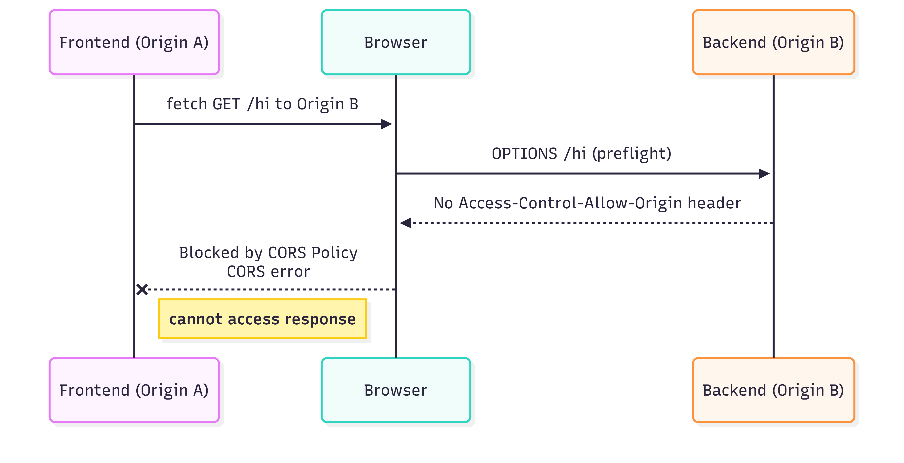
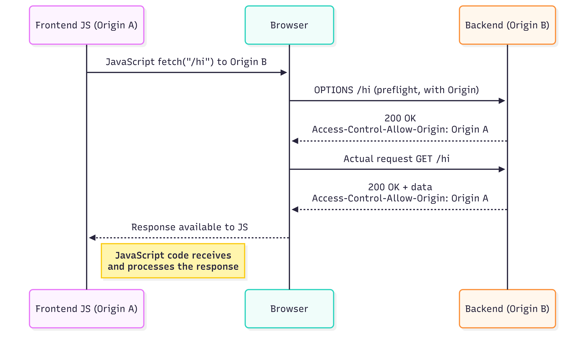
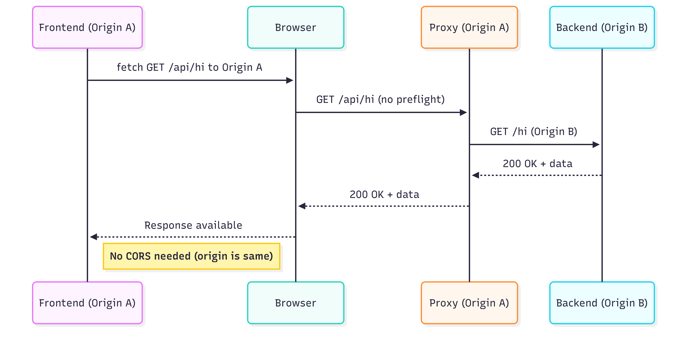

# CORS Workshop

## What you'll learn?

- Learn about the existence of CORS (cross origin resource sharing)
- Learn about why this exist
- Learn about how this affects communication between frontend and backend
- Learn about the alternative (proxying request)
- See what changes you need to make to migrate from one setup to the other

## Steps for you to try during

### Scenario 1 - CORS without CORS setup

**Note**: Origin A is http://localhost:5173, Origin B is http://localhost:8080



- Start frontend, `cd frontend-react` then `npm install` then `npm run dev`
- In another terminal start a backend, e.g. `cd backend-asp` then `dotnet run` or `cd backend-spring` then `./mvnw spring-boot:run`
- Open http://localhost:5173 in your browser and open devtools

Things to note:
- In `fetch` we use an absolute URL, localhost:8080, not a relative URL
- `fetch at 'http://localhost:8080/hi' from origin 'http://localhost:5173' has been blocked by CORS policy`
- This is expected, browser blocks cross origin resource sharing because the backend doesn't allow it.
- Servers almost always default to _block_ CORS when asked by a sane browser
- Requests not sent from a browser (e.g. `curl http://localhost:8080/hi`) aren't block, CORS is enforced by the browser only

### Scenario 2 - CORS with CORS setup in place



- Configure allowing CORS on the backend (uncomment the related lines in the backend projects)
    - For more on configuring CORS in ASP [see this guide](https://learn.microsoft.com/en-us/aspnet/core/security/cors?view=aspnetcore-10.0#cors-with-default-policy-and-middleware)
    - For more on configuring CORS in Spring [see this guide](https://www.baeldung.com/spring-cors#bd-2-crossorigin-on-the-controller)
- Restart the backend
- Visit http://localhost:5173, open devtools

Things to note:
- In `fetch` we use an absolute URL still, localhost:8080, not a relative URL
- No CORS related error
- fetch is successful
- Hardcoding the cross origin to a specific thing like localhost:5173 is bad practice, externalize this configuration in production

### Scenario 3 - Proxying instead of CORS



- Remove/comment out CORS config on backends
- Uncomment proxy config in `vite.config.js` (see [more on this here](https://vite.dev/config/server-options#server-proxy))
- Rewrite `URL` in `App.jsx` to `/api/hi`
- Restart the frontend dev server
- Visit http://localhost:5173, open devtools

Things to note:
- In `fetch` we use a relative URL, `/api/hi`, not an absolute URL
- The proxy config strips the leading `/api` this is not a requirement, but some frameworks rely on this by default (not Vite)

## The steps to create this repo's contents

- Create a sample frontend project with `npm create vite@latest` (using [NPM](https://www.npmjs.com/)) choose React and JavaScript, save this in the `frontend-react` folder
- Create a sample backend project with `spring init --dependencies=web backend-spring` (using the [Spring CLI](https://docs.spring.io/spring-boot/cli/index.html))
- Create a sample backend project with `dotnet new web --name backend-asp` (using the [.NET CLI](https://learn.microsoft.com/en-us/dotnet/core/tools/))
- Add `GET /hi` that returns some fixed strings to backend projects
- Add a fetch on page load to http://localhost:8080/hi to the frontend project
- Configure both backends to use port 8080 (Spring uses that by default, rewrite the ASP project's `launchSettings.json` to use port 8080 for HTTP)

## Mermaid chart sources for diagrams

### Scenario 1

```
sequenceDiagram
    participant FE as Frontend (Origin A)
    participant Browser
    participant BE as Backend (Origin B)

    FE->>Browser: fetch GET /hi to Origin B
    Browser->>BE: OPTIONS /hi (preflight)
    BE-->>Browser: No Access-Control-Allow-Origin header
    Browser--xFE: Blocked by CORS Policy<br/>CORS error
    Note right of FE: cannot access response
```

### Scenario 2

```
sequenceDiagram
    participant FE as Frontend (Origin A)
    participant Browser
    participant BE as Backend (Origin B)

    FE->>Browser: fetch /GET to Origin B
    Browser->>BE: OPTIONS /hi (preflight)
    BE-->>Browser: 200 OK<br/>Access-Control-Allow-Origin: Origin A
    Browser->>BE: Actual request GET /hi
    BE-->>Browser: 200 OK + data<br/>Access-Control-Allow-Origin: Origin A
    Browser-->>FE: Response available
    Note right of FE: Code receives<br/>and processes response
```

### Scenario 3

```
sequenceDiagram
    participant FE as Frontend (Origin A)
    participant Browser
    participant Proxy as Proxy (Origin A)
    participant BE as Backend (Origin B)

    FE->>Browser: fetch GET /api/hi to Origin A
    Browser->>Proxy: GET /api/hi (no preflight)
    Proxy->>BE: GET /hi (Origin B)
    BE-->>Proxy: 200 OK + data
    Proxy-->>Browser: 200 OK + data
    Browser-->>FE: Response available
    Note right of FE: No CORS needed (origin is same)
```